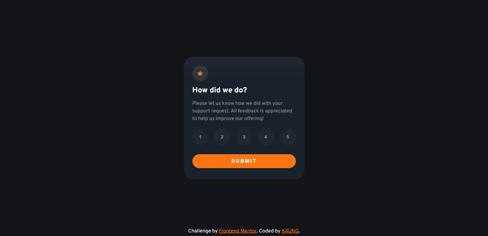

# Frontend Mentor - Interactive rating component solution

This is a solution to the [Interactive rating component challenge on Frontend Mentor](https://www.frontendmentor.io/challenges/interactive-rating-component-koxpeBUmI). Frontend Mentor challenges help you improve your coding skills by building realistic projects. 

## Table of contents

- [Overview](#overview)
  - [The challenge](#the-challenge)
  - [Screenshot](#screenshot)
  - [Links](#links)
- [My process](#my-process)
  - [Built with](#built-with)
  - [What I learned](#what-i-learned)

### The challenge

Users should be able to:

- View the optimal layout for the app depending on their device's screen size
- See hover states for all interactive elements on the page
- Select and submit a number rating
- See the "Thank you" card state after submitting a rating

### Screenshot

### Links

- Solution URL: [Solution URL ](https://github.com/K4UNG/project-15-interactive-rating-component)
- Live Site URL: [Live URL](https://k4ung15.netlify.app)

## My process

### Built with

- Semantic HTML5 markup
- CSS custom properties
- Sass
- JavaScript

### What I learned

I've been wanting to try out Sass forever and I thought this challenge would be a great fit for it so I took it and it was awesome. I learned a lot about Sass and 3d transformation properties.
